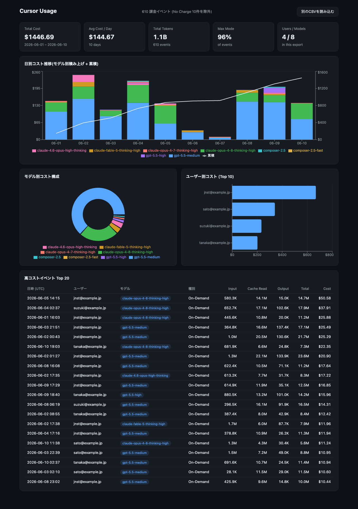

# cursor-usage

Visualize the usage events CSV exported from the Cursor dashboard.

- **Terminal**: summary and bar charts right in your terminal
- **Dashboard**: a local web dashboard — just drag & drop your CSV



Runs on Node.js 20+ (`npx`) or [Bun](https://bun.sh) (`bunx`).

## Usage

### Dashboard (default)

```bash
npx cursor-usage   # or: bunx cursor-usage
```

Starts a local server and opens your browser. Drag & drop a CSV exported from Cursor onto the page. All data is processed in the browser and never sent anywhere.

The default port is 4321; if it is already in use, a free port is picked automatically. When `--port` is specified explicitly, that port is used as-is.

```bash
npx cursor-usage serve --port 8080 --no-open
```

### Terminal stats

```bash
npx cursor-usage stats team-usage-events.csv
```

```
Cursor Usage  2026-06-01 – 2026-06-10  (610 events, 10 days)

  Total Cost    $1446.69      Total Tokens  1.1B
  Avg/Day       $144.67       Max Mode      96%
  Users         4             Models        8

Daily Cost
  2026-06-01  $147.44  ████████████████▊            10% 102.9M tok, 68 ev
  2026-06-02  $246.57  ████████████████████████████ 17% 180.0M tok, 79 ev
  ...

By Model
  gpt-5.5-medium                 $954.95  ████████████████████████████ 66% 804.2M tok, 472 ev
  claude-opus-4-8-thinking-high  $357.92  ██████████▌                  25% 135.5M tok, 69 ev
  ...
```

Options:

| Option | Description |
| --- | --- |
| `--by <day\|user\|model>` | Show a single breakdown axis |
| `--json` | Output aggregated stats as JSON (pipe to jq etc.) |
| `--include-no-charge` | Include "Errored, No Charge" events |

```bash
# Extract key numbers
npx cursor-usage stats usage.csv --json | jq .summary.totalCost
```

## Development

Development tooling uses [Bun](https://bun.sh) (runtime code itself is Node-compatible).

```bash
bun install
bun test              # core logic tests
bun run dev           # dev server with hot reload
bun run build         # bundle CLI and dashboard into dist/
bun dist/cli.js stats usage.csv

# Generate a dummy CSV for screenshots
bun scripts/generate-dummy-csv.ts > dummy-usage.csv
```

## Architecture

- `src/core/` — CSV parsing and aggregation (pure TS, shared between terminal and browser)
- `src/cli/` — CLI entry point and terminal rendering
- `src/server/` — static file server built on `Bun.serve`
- `web/` — React + Recharts dashboard (bundled at build time)

## License

MIT
