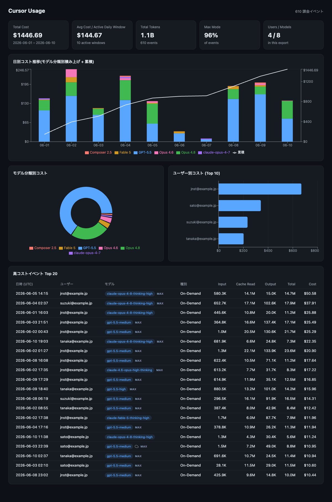

# cursor-usage

Visualize the usage events CSV exported from the Cursor dashboard.

- **Terminal**: summary and bar charts right in your terminal
- **Dashboard**: a local web dashboard — just drag & drop your CSV



Runs on Node.js 20+ (`npx`) or [Bun](https://bun.sh) (`bunx`).

## Features

- **Local-only analysis** — drag & drop a Usage Export; data stays in the browser and is never sent anywhere
- **Daily Window cost trends** — stacked bars by Model Family plus a cumulative line, with click-through to a per-window detail view
- **Model Family grouping** — reasoning effort / thinking / fast variants are collapsed, and Auto (Cursor Router) is one slice; click it to see the actual Models the Router selected
- **User breakdown & filter** — Top 10 costs per User; click a bar to focus the whole analysis on one User
- **High Cost events** — the most expensive events at a glance, with Cloud Agent / Automation / Max Mode / Fast Mode Event Labels
- **Daily Window detail** — hourly cost, Kind breakdown, and every event in the window
- **CLI parity** — the same breakdowns in the terminal, or as JSON for scripting
- **Screenshots & daily report** — capture the Overview or a shareable Daily Window PNG

## Usage

### Dashboard (default)

```bash
npx @jnst/cursor-usage   # or: bunx @jnst/cursor-usage
```

Starts a local server and opens your browser. Drag & drop a CSV exported from Cursor onto the page. All data is processed in the browser and never sent anywhere.

Click any bar in the Daily Window cost chart to drill into that window (hourly breakdown, per-model-family / per-user / per-kind costs, and every event in the window). Cost charts group Models by Model Family — variant suffixes such as reasoning effort and fast mode are collapsed, and usage routed through Auto (Cursor Router) is shown as one `Auto` slice. Click a slice in the Model Family pie to see the Models inside it; for `Auto` this reveals the actual Models the Router selected. Click a user bar to filter the current analysis to that User; the selected User remains visible while other users are dimmed, and clicking the selected user again clears the filter. The selected Daily Window, user, and analysis time zone are reflected in the URL hash (`#daily-window=YYYY-MM-DD&user=jnst%40example.jp&timezone=Asia%2FTokyo`), so the browser back button and shareable links work after loading the same CSV.

The default port is 4321; if it is already in use, a free port is picked automatically. When `--port` is specified explicitly, that port is used as-is.

```bash
npx @jnst/cursor-usage serve --port 8080 --no-open
```

### Terminal stats

```bash
npx @jnst/cursor-usage stats team-usage-events.csv
```

```
Cursor Usage  2026-06-01 – 2026-06-10  (610 events, 10 daily windows)

  Total Cost    $1446.69      Total Tokens  1.1B
  Avg Daily     $144.67
  Models        8             Users         4

Daily Window Cost
  2026-06-01  $147.44  ████████████████▊            10% 102.9M tok, 68 ev
  2026-06-02  $246.57  ████████████████████████████ 17% 180.0M tok, 79 ev
  ...

By Model Family
  GPT-5.5   $954.95  ████████████████████████████ 66% 804.2M tok, 472 ev
  Opus 4.8  $357.92  ██████████▌                  25% 135.5M tok, 69 ev
  ...
```

Options:

| Option                                           | Description                                                    |
| ------------------------------------------------ | -------------------------------------------------------------- |
| `--by <daily-window\|user\|model\|model-family>` | Show a single breakdown axis                                   |
| `--daily-window <YYYY-MM-DD>`                    | Drill into a single Daily Window                               |
| `--start-hour <0-23>`                            | Daily Window start hour (default: `0`)                         |
| `--user <identifier>`                            | Filter analysis to a single User                               |
| `--model-family <name>`                          | Filter analysis to a single Model Family (e.g. `Auto`)         |
| `--timezone <iana-tz>`                           | Group Daily Windows and hours in a specific analysis time zone |
| `--metric <cost\|tokens>`                        | Selected Metric for ranking and display (default: `cost`)      |
| `--json`                                         | Output aggregated stats as JSON (pipe to jq etc.)              |
| `--include-no-charge`                            | Include "Errored, No Charge" events                            |

```bash
# Extract key numbers
npx @jnst/cursor-usage stats usage.csv --json | jq .summary.totalCost

# Drill into a Daily Window
npx @jnst/cursor-usage stats usage.csv --daily-window 2026-06-02 --timezone Asia/Tokyo

# Filter to a single user
npx @jnst/cursor-usage stats usage.csv --user jnst@example.jp

# See the Models inside one Model Family (e.g. what Auto routed to)
npx @jnst/cursor-usage stats usage.csv --model-family Auto --by model

# Rank and display by Token Count instead of Cost
npx @jnst/cursor-usage stats usage.csv --metric tokens
```

Or install globally to use the short `cursor-usage` command:

```bash
npm install -g @jnst/cursor-usage   # or: bun add -g @jnst/cursor-usage
cursor-usage stats usage.csv
```

### User Effective Rate

The four User Top 10 panels use horizontal bars in a two-column, two-row layout,
with independent high-to-low and low-to-high controls.
Cost and Token Count default to highest first; Effective Rate defaults to lowest
first. CLI User rankings accept `--user-order asc|desc`, for example
`stats usage.csv --by user-effective-rate --user-order desc` or
`stats usage.csv --by user --metric tokens --user-order asc`.

```bash
npx @jnst/cursor-usage stats usage.csv --by user-effective-rate
```

Shows the ten Users with the lowest aggregate reported Cost per million tokens
(`$ / MTok`), alongside Cost and Token Count. No Charge Events and Users with
zero tokens or zero total reported Cost are excluded; there is no minimum usage threshold. Model and cache
mix affect this diagnostic, so it is not a productivity score. Overview and
Daily Window JSON expose the same ranking as `topUsersByEffectiveRate`.

The dashboard always shows Cost and Token Count together. Terminal
`stats --metric cost|tokens` still selects ranking order; legacy screenshot
`--metric` options and dashboard `metric` URL values are accepted but no longer
switch the displayed Metric.

### Cloud Agent Usage Rate

Cloud Agent Usage Rate ranks the percentage of each User's billable event rows
with a nonempty Cloud Agent ID. Repeated IDs count for each event, No Charge
events are excluded from both counts, and 0% Users remain eligible. The default
is highest first. Use `stats usage.csv --by user-cloud-agent` (optionally with
`--user-order asc`) for terminal output. JSON includes `topUsersByCloudAgentUsage`
with the rate as a percentage and both event counts.

### Screenshots

```bash
npx @jnst/cursor-usage screenshot team-usage-events.csv
```

Captures the dashboard as a PNG next to the CSV. The default screenshot is an
Overview. Cost and Token Count charts are stacked vertically at full width, with User Cost, Token Count,
Effective Rate, and Cloud Agent Usage Rate Top 10 rankings in the same image (1400px wide). Model Family
breakdowns and event details are always visible. Readability takes priority over
fitting a fixed page height:

```text
team-usage-events.csv -> team-usage-events.png
```

Use `--daily-window` to capture the detail view for one Daily Window:

```bash
npx @jnst/cursor-usage screenshot team-usage-events.csv --daily-window 2026-06-14
```

```text
team-usage-events.csv --daily-window 2026-06-14 -> team-usage-events-2026-06-14-daily.png
```

Use `--start-hour` when a Daily Window should start after midnight, and
`--event-limit` to limit the event table in the screenshot:

```bash
npx @jnst/cursor-usage screenshot usage.csv --daily-window 2026-06-14 --start-hour 5 --event-limit 20
```

For a shareable report of the latest work session in the CSV, use
`daily-report`. It captures the latest 5:00-start Daily Window with both Metrics
and all four User rankings, and writes `daily-report.png` in the current
directory. Model Family and Kind breakdowns are visible, along with the top 10
events by Cost. The image captures the full page:

```bash
npx @jnst/cursor-usage daily-report usage.csv
```

Screenshots use a headless browser and require an installed Chrome/Chromium.
Set `CHROME_PATH` if Chrome is not available on the default channel. Screenshots
can also be filtered the same way as terminal stats:

```bash
npx @jnst/cursor-usage screenshot usage.csv --daily-window 2026-06-14 --user jnst@example.jp --timezone Asia/Tokyo
npx @jnst/cursor-usage screenshot usage.csv --out dashboard.png
```

## Development

Development tooling uses [Bun](https://bun.sh) (runtime code itself is Node-compatible).

```bash
bun install
bun test              # core logic tests
bun run dev           # dev server with hot reload
bun run build         # bundle CLI and dashboard into dist/
bun dist/cli.js stats usage.csv

# Generate a dummy CSV for screenshots
bun scripts/generate-dummy-csv.ts > dummy-usage.csv
```

### Release

The release command verifies, versions, publishes, pushes commits/tags, and creates a
GitHub Release with generated notes:

```bash
bun run release
```

Use `--dry-run` to print mutating steps without running them:

```bash
bun run release --dry-run
```

The release command is safe to rerun after a partial failure. The script checks
the current tag, npm package version, and GitHub Release before each publishing
step:

```bash
# If npm publish, git push, or GitHub Release creation failed midway,
# fix the problem and run the same command again.
bun run release
```

## Architecture

- `src/core/` — CSV parsing and aggregation (pure TS, shared between terminal and browser)
- `src/cli/` — CLI entry point and terminal rendering
- `src/server/` — static file server built on `Bun.serve`
- `web/` — React + Recharts dashboard (bundled at build time)

## License

MIT
